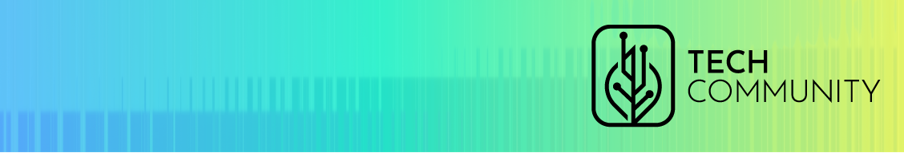
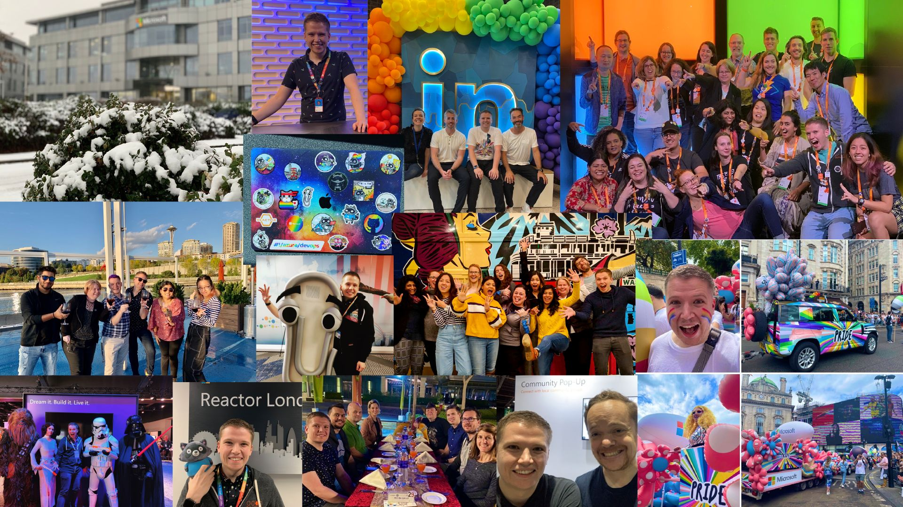

# Tech Community Consulting
Thanks for visiting the site! Tech Community Consulting was set up to help tech organisations connect with technical communities around the world. Adam Jackson is the founder and has over 10 years of experience working with Developers & IT Professionals in global and local communities. After his time at Microsoft working in Developer Relations, he was inspired to help a wider range of organisations build this capability.

---

# What we do
We have experience in the following areas:
- Helping you build a network of user groups/meetups allied to your products
- Nurturing the trust of Developers & IT Professionals in the community
- Creating and nurturing communities of speakers, organisers & writers _(I try to avoid using the word 'influencer' here!)_
- Tech Event management - for your own conference or participation in one _(including help with your existing events)_
- Organising your hackathons, whether in-person or online
- Tech Marketing strategy
- Online content & social strategy
- Online video guidance & production services
- Build your learning/docs strategy to skill devs & IT pros in your product

## What we _don't_ (yet) do
- Provide tech speakers or virtual advocacy for your organisation  - but we may be able to help you find the right person
- Getting involved with your code or finding you developers for your projects

# Organisations we've worked with
- [**Green Software Foundation**](https://greensoftware.foundation): Adam is currently spending most of his work week supporting the [Green Software Foundation](https://greensoftware.foundation) as their Senior Community Project Manager. The Green Software Foundation is building trusted ecosystem of people, standards, tooling and best practices for Green Software - helping software practitioners decarbonise their software. Adam's role there is to provide strategic consultancy to the Community Working Group and to be a hands-on PM for that group and the related projects including _Meetups, CarbonHack, Contributors & Experts & Learning_. He is also heavily involved in producing all events and works closely with GSF members including _Microsoft, GitHub, Google, Avanade & UBS_ to name a few.
- [**Microsoft**](https://aka.ms/ukdeveloper): Adam previously worked at Microsoft for over 10 years, with a vast portfolio of experience working with technical communities both in the UK and globally. He was responsible for the overall strategy for Developer Relations at Microsoft UK and also responsible for a portfolio of community activity across global events including Microsoft Build & Microsoft Ignite. He was responsible for the growth of the Microsoft Learn platform in the UK in the Developer & IT Pro communities.

# Get in touch
We'd love to hear from you! The easiest way of contacting us is [over email](mailto:enquiry@tech-community.co.uk). You can also contact Adam directly via [LinkedIn](https://www.linkedin.com/in/adampjackson/). 

---
### Legal Notice
Tech Community Consulting Ltd. (company number 14746821) is a is a company registered in England and Wales.
